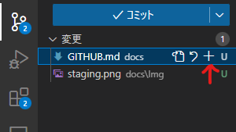
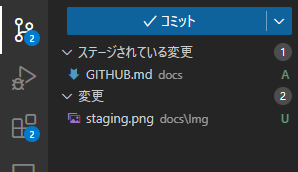
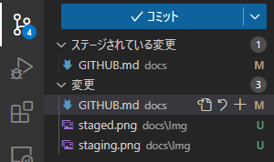
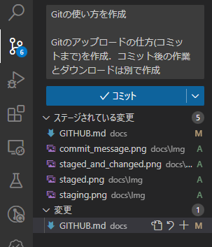

# Github の使い方

---

## 1. 変更したファイルをアップロードする方法

### 1.1. vscodeを使った手順

vscodeの左側の上から3番目，ソースを管理を開く．

#### 1. ステージングしたいファイルを選択する（インデックスに追加）

ステージングしたいファイルを選択すると，右側に変更箇所が確認できる．問題がなければプラスボタンを押す．

これにより，コミットしたいファイルの選別や完了したファイルの保護がされる．
保護されるというのは，ステージングされた上で変更した場合，ステージングとは別に，変更へ追加される．さらにファイルを選択するとステージングとの差分を示してくれるため，不意に変更した場合でも変更箇所のチェックが用意になる．

#### 2. インデックスをコミットする

インデックスをgitに登録する．コミットにはタイトルと詳細を書く．すべてのファイルをステージングする必要はなく，コミットに適したものだけ追加する．

コミットの粒度は，その日ごとの作業をコミットしたり，機能をごとにコミットを切るなど，プロジェクトや人によって違う．

リベースで綺麗にコミットグラフを書くことができるが，他人のコミットなど変更されるので，ローカル環境で使うのを推奨．はじめは難しいから使わなくてもOK

### 3. マージする
