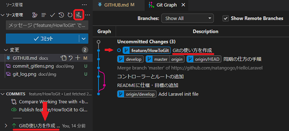

# Github の使い方

---

## 1. 変更したファイルをアップロードする方法

### 1.1. vscodeを使った手順

vscodeの左側の上から3番目，ソースを管理を開く．

#### 1. ブランチの作成と編集


ブランチを作成したら基本的には，そのブランチに切り替わる．左下に作成した名前のブランチになっていればOK．なっていなければ，そこを押して切り替えるか，マージのとこで説明している方法で切り替える．

その後ファイルを編集を行う．

#### 2. ステージングしたいファイルを選択する（インデックスに追加）

ステージングしたいファイルを選択すると，右側に変更箇所が確認できる．問題がなければプラスボタンを押す．


これにより，コミットしたいファイルの選別や完了したファイルの保護がされる．
保護されるというのは，ステージングされた上で変更した場合，ステージングとは別に，変更へ追加される．さらにファイルを選択するとステージングとの差分を示してくれるため，不意に変更した場合でも変更箇所のチェックが用意になる．


#### 3. インデックスをコミットする

インデックスをgitに登録する．コミットにはタイトルと詳細を書く．すべてのファイルをステージングする必要はなく，ブランチに適したものだけ追加する．


コミットの粒度は，その日ごとの作業をコミットしたり，機能をごとにコミットを切るなど，プロジェクトや人によって違う．

リベースで綺麗にコミットグラフを書くことができるが，他人のコミットなど変更されるので，ローカル環境で使うのを推奨．はじめは難しいから使わなくてもOK

コミットを確認するには，```git log```で確認可能


```Enter```で一行ごと，```Space```でページごと，進める．```q```で終わる．

オプションを使えばいろいろあるけど，知りたかったら調べて．
GitLensを使えば，GUIで楽に確認できる


### 4. コミットを別ブランチにマージする

リモートに反映したいブランチに切り替える．マージは他のブランチの変更内容を取り込むイメージ．そのため，ブランチを切り替える必要がある．機能が完成したらdevelopに反映すると思ったらいい．
```git switch```なるものがあるらしいけど使ったことない(便利らしいけど，今回はコマンドをなるべく使わない方法なため取り上げない)．


チェックアウト先を選んだら次はマージを選択する


これにより変更が現在のブランチに取り込めたはず．また，マージ元のブランチは，削除しましょう．必要になればまたブランチを新たに切ってから同じ手順でマージまで行う．

### 5. 取り込んだブランチをリモートに同期する

マージが終わり，リモートと同期したい場合は，ブランチの発行をすることで，同期ができる．


Githubにアクセスし，変更が反映されているか確認する．
